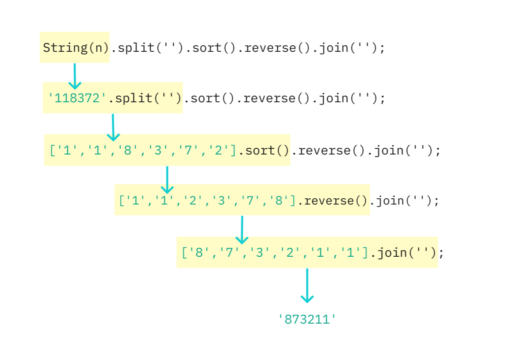

## https + ssl 적용방법

> Let's Encrypt를 사용하여 nginx에 적용을 시키고
>
> http와 https의 도메인/api로 들어오게 되면 만들어둔 서버 api로 라우팅 시킴

## 개발 버전

> Next
>
> - 14버전
> - app router
> - server action
>
> React-Native
>
> - 0.72버전

<details>
<summary>Sync와 Async의 차이점을 설명해 주세요.</summary>
Sync는 요청을 보내고 해당 요청에 대한 응답을 기다리는 것을 의미하고,

Async는 요청에 대한 응답을 기다리지 않고 다음 동작을 수행하는 것을 의미합니다.

</details>
<br/>

<details>

<summary>Blocking과 Non-Blocking의 차이를 설명해 주세요.</summary>
블로킹과 논블로킹은 작업을 수행할 때 제어권이 누구한테 있는지에 따라 구분됩니다.

블로킹은 한 작업이 완료될 때까지 다음 작업을 수행하지 않는 것을 의미합니다.

논블로킹은 한 작업이 완료되지 않아도 다음 작업을 수행할 수 있는 것을 의미합니다.

</details>
<br/>

<details>
<summary>Event loop에 대해 설명해 주세요.</summary>

자바스크립트의 이벤트 루프는 단일 스레드에서 실행되는 비동기 작업을 처리하는 메커니즘입니다. 이벤트 루프는 Call stack, Micro task queue, Macro task queue로 구성됩니다.

Micro task queue에는 Promise, async/await 과 같은 작업들이 들어가고, Macro task queue에는 Web API (setInterval, setTimeout)와 같은 작업들이 들어갑니다.

이벤트 루프는 Call stack을 확인하고, Call stack이 비어있는 경우 Micro task queue의 작업을 Call stack으로 옮깁니다. 그리고 Micro task queue가 비어있는 경우, Macro task queue의 작업을 Call stack으로 옮기고 처리합니다.

</details>

<br/>

<details>
<summary>var, let, const의 차이를 설명해 주세요.</summary>

| var             | let              | const            |
| --------------- | ---------------- | ---------------- |
| 중복 선언 가능  | 중복 선언 불가능 | 중복 선언 불가능 |
| 함수레벨 스코프 | 블록레벨 스코프  | 블록레벨 스코프  |
| 재할당 가능     | 재할당 가능      | 재할당 불가능    |

</details>
<br/>

<details>
<summary>일반 함수와 화살표 함수의 차이</summary>

| 일반 함수                                                   | 화살표 함수                                                                                                     |
| ----------------------------------------------------------- | --------------------------------------------------------------------------------------------------------------- |
| 함수 호출방식에 따라 this에 바인딩할 객체가 동적으로 결정됨 | 화살표 함수의 this는 언제나 상위 스코프의 this(Lexical this)를 가리키며, this에 바인딩할 객체가 정적으로 결정됨 |

</details>
<br/>

<details>
<summary>메서드 체이닝에 대해 설명해 주세요.</summary>

메서드가 객체를 반환하게 되면 메서드의 반환 값인 객체를 통해 또 다른 함수를 호출할 수 있다. 이러한 프로그래밍 패턴을 메서드 체이닝(Method Chaining)이라 부른다.



</details>

<br/>

<details>
<summary>this의 의미를 설명해 주세요.</summary>

this는 자신이 속한 객체 또는 자신이 생성할 인스턴스를 가리키는 자기 참조 변수다.

</details>
<br/>

<details>
<summary>함수 선언형과 함수 표현식의 차이를 설명해 주세요.</summary>

함수 선언형(Function Declaration)의 경우 function 키워드를 사용하여 함수를 정의합니다. 함수 선연형은 호이스팅 되기 때문에 코드가 실행되기 전에 로드되고 선언하기 전에도 호출이 가능합니다.

함수 표현식(Function Expression)의 경우 변수에 함수를 할당하는 방식으로 함수를 정의합니다. 함수 표현식은 함수가 선언된 이후에만 호출이 가능하며, 함수가 할당된 변수가 접근 가능한 스코프 내에서만 호출할 수 있습니다.

</details>

<br/>

<details>
<summary>호이스팅에 대해 설명해 주세요.</summary>

호이스팅(Hoisting)은 변수 및 함수의 선언이 스코프 내의 최상단으로 끌어올려지는 것 같은 현상

주의할 점 : 함수 표현식은 호이스팅되지 않습니다. 함수 표현식은 변수에 함수를 할당하는 형태로, 변수의 할당 부분만 호이스팅됩니다.

</details>

<br/>

<details>
<summary>이벤트 버블링과 이벤트 캡처링에 대해 설명해 주세요.</summary>

이벤트 버블링(Event Bubbling)은 이벤트가 발생한 요소에서 상위 요소로 이벤트가 전파되는 과정을 말합니다.

이벤트 캡처링(Event Capturing)은 이벤트가 상위 요소에서 하위 요소로 이벤트가 전파되는 과정을 말합니다.

</details>
<br/>

<details>
<summary>이벤트 전파와 이벤트 위임에 대해 설명해 주세요.</summary>

이벤트 전파(Event Propagation)는 DOM 트리 상의 특정 Element node에서 이벤트가 발생하여 다른 Element node로 이벤트가 전파되는 것을 의미합니다.

이벤트의 전파는 Event capturing -> Target -> Event bubbling 순으로 일어납니다.

이벤트 위임(Event Delegation)은 하위 요소마다 이벤트를 추가하지 않고 상위 요소에서 하위 요소의 이벤트들을 제어하는 것을 의미합니다.

</details>
<br/>

<details>
<summary>스코프와 클로져</summary>

## [스코프]

스코프란 변수(식별자)에 접근할 수 있는 유효한 범위를 뜻합니다.

### 1. 전역 스코프(Global scope)

코드 어디에서든지 접근 가능

### 2. 함수 스코프(Local scope)

함수 내에서만 유효한 범위를 갖게 하는 스코프

전역 스코프완 반대되는 개념으로 지역 스코프(Local scope)라고도 불림

### 3. 블록 스코프(Black scope)

블록단위{} 내에서만 유효한 범위를 갖게 하는 스코프

## [스코프 체인]

스코프 체인이란, 현재 스코프에서 식별자를 검색할 때 상위 스코프를 연쇄적으로 찾아나가는 방식을 의미합니다.

변수를 참조할 때 자바스크립트 엔진은 스코프 체인을 통해 해당 변수를 참조하는 코드의 스코프부터 상위 스코프 방향으로 이동하며 선언된 변수를 검색합니다.

## [클로져]

클로저란 외부 함수의 변수에 접근할 수 있는 내부 함수, 또는 이러한 작동 원리를 일컫는 말이다.

### 1. 커링

클로저 함수의 외부 함수를 템플릿처럼 사용할 수 있다.

```javascript
function callFamily(last_name) {
  return function (first_name) {
    return `Hey, ${first_name} ${last_name}`;
  };
}

callFamily("James")("Jones"); // Hey, James Jones

let callLees = callFamily("Lee");

callLees("youjin"); // Hey, youjin Lee
callLees("youngjae"); // Hey, youngjae Lee

let callHollys = callFamily("Holly");

callLees("wendy"); // Hey, wendy Holly
callLees("honey"); // Hey, honey Holly 2. 클로저 모듈 패턴
```

### 2. 클로저 모듈 패턴

변수를 클로저 함수의 스코프에 가두어 함수 밖으로 노출시키지 않는 방법이다. 공개하고 싶지 않은 변수가 있을 때 유용하다.

```javascript
function counter() {
  let initialVal = 3;

  return {
    add: function () {
      initialVal += 2;
    },
    sub: function () {
      initialVal -= 2;
    },
    getVal: function () {
      return initialVal;
    },
  };
}

let calc1 = counter();
calc1.add();
calc1.add();
calc1.getVal(); // 7

let calc2 = counter();
calc2.add();
calc2.sub();
calc2.sub();
calc2.getVal(); // 1
```

</details>
<br/>

<details>
<summary>throttle과 debounce에 대해 설명해 주세요.</summary>

## debounce

요청이 들어오고 일정 시간을 기다린 후 요청을 수행한다. 만약 일정 시간 안에 같은 요청이 추가로 들어오면 이전 요청은 취소된다

## throttle

일정 시간 동안 요청이 한 번만 수행되도록 한다.

</details>

<br/>

<details>
<summary>자바스크립트 동작 원리에 대해 설명해 주세요.</summary>

자바스크립트는 싱글 스레드 기반의 언어이며, V8 엔진을 사용합니다. V8 엔진의 경우 크게 메모리 힙(Memory heap)과 콜 스택(Call stack) 두 요소로 구성되어 있습니다.

### [Memory heap]

메모리 할당이 이뤄지는 곳입니다.

### [Call Stack]

코드가 실행될 때 호출 스택이 쌓이는 곳입니다.

### [Web APIs]

콜 스택에서 실행된 비동기 함수는 Web API를 호출하고, Web API는 콜백 함수를 콜백 큐에 밀어 넣습니다.

Web API에는 DOM, Ajax, SetTimeout 등등이 존재합니다.

### [Callback Queue]

함수를 저장하는 자료구조로, 선입선출 형식으로 함수를 처리합니다.

TaskQueue라고도 불립니다.

### [Event Loop]

이벤트 루프는 콜 스택이 다 비워지면 콜백 큐에 존재하는 함수들을 하나씩 콜 스택에 옮기는 역할을 합니다.

</details>
<br/>
